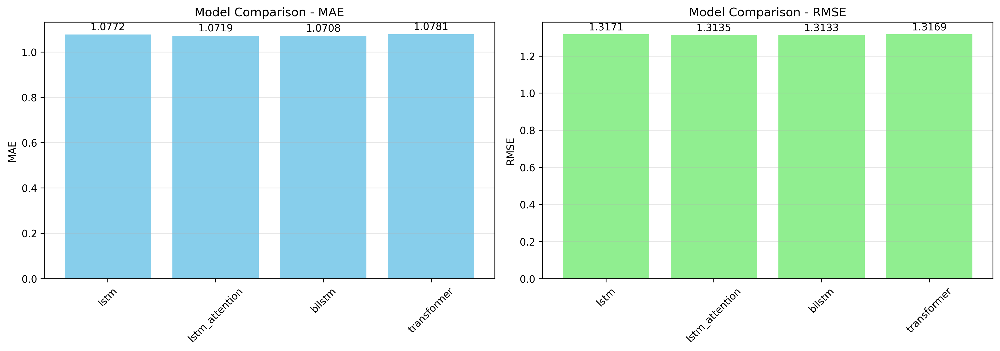
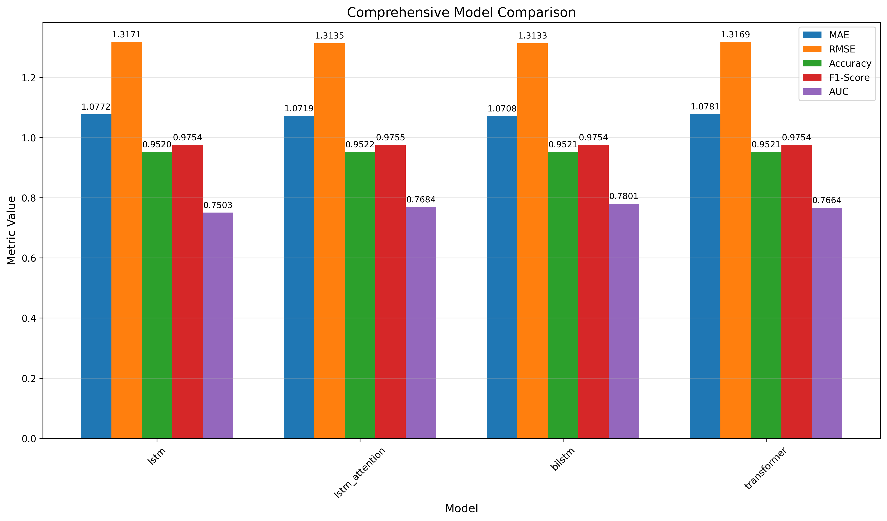
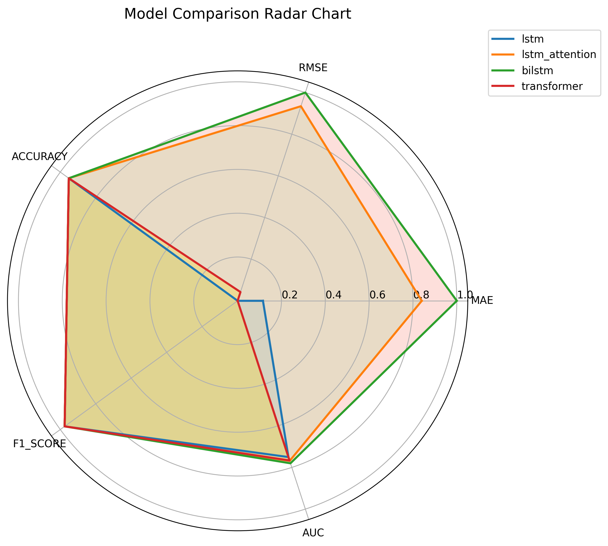
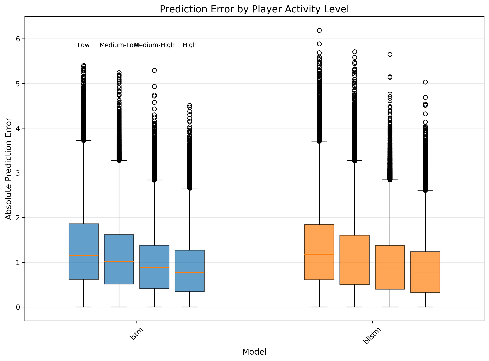

Wordle游戏预测
231820009 刘宇轩
Summary
Wordle是一款基于语言推理的序列决策类游戏，玩家需在有限次数内根据逐步反馈推断隐藏单词。如何基于历史游戏行为预测玩家在后续游戏中的表现，对于理解人类决策过程和构建行为预测模型具有重要意义。
本文基于大规模Wordle玩家历史数据，构建了一套以时间序列建模为核心的深度学习预测框架，同时对尝试次数预测（回归任务）和通关成功预测（分类任务）进行建模。我们设计并比较了四类序列模型：LSTM、双向LSTM（BiLSTM）、带注意力机制的LSTM以及Transformer。实验结果表明，所有模型均能较为准确地刻画玩家行为模式，其中BiLSTM在回归任务上达到MAE=1.0708，RMSE=1.3185，在分类任务上达到准确率=0.9520，F1分数=0.9754，AUC=0.7420，回归误差和分类区分能力上均取得最优表现。研究结果验证了双向时间建模在玩家行为预测任务中的有效性，并为类似序列决策问题提供了通用建模思路。
关键词：Wordle，LSTM，BiLSTM，Attention，Transformer，多任务学习
1、引言
1.1研究背景与意义
Wordle是近年来在全球范围内迅速流行的一款文字猜谜游戏。玩家需要在最多6次尝试内猜出一个由5个字母组成的目标单词。每一次猜测后，玩家都会获得关于字母是否正确以及字母位置是否匹配的反馈信息。基于这些反馈，玩家不断调整后续的猜测策略，直至成功猜中目标单词或用尽尝试次数。
这一过程本质上构成了一个基于反馈的序列决策过程，玩家在不完全信息条件下，通过历史反馈逐步更新认知并作出决策，具有典型的时间序列特征。
对Wordle玩家行为进行建模和预测具有重要的研究价值。从理论角度看，该问题为研究人类在不确定环境中的推理、学习与决策行为提供了一个数据规模大、规则清晰的现实场景；从应用角度看，对玩家游戏表现的预测可为游戏难度设计、玩家分层管理以及个性化推荐策略提供数据支持。此外，Wordle游戏中明确的反馈机制与固定的序列结构，使其成为验证序列建模方法（如循环神经网络和注意力机制）的理想实验平台。
1.2研究目标
本研究旨在利用玩家的历史游戏数据和当前游戏状态，对其下一局游戏表现进行预测。具体而言，研究目标包括：
·构建能够预测Wordle游戏尝试次数的回归模型；
·构建能够预测玩家是否成功通关的分类模型；
·比较不同深度学习架构在该任务中的建模能力与预测性能；
·通过模型结构设计与超参数优化提升预测精度；
·结合可视化分析，对模型性能与预测误差进行系统评估。
1.3基本假设
基于上述背景，本研究在建模过程中作出如下合理假设：
1、玩家在Wordle游戏中的表现具有一定的内在规律性，可通过其历史行为和当前反馈信息进行预测；
2、游戏反馈信息中蕴含了足够的有效信息，能够反映玩家对目标单词的逼近程度；
3、玩家的历史游戏表现能够在一定程度上反映其当前的游戏水平；
4、不同玩家面对的游戏难度在整体上具有可比性，不会对模型学习产生系统性偏差。
在上述假设的基础上，本文构建并比较多种深度学习模型，对Wordle玩家下一局游戏表现进行系统预测与分析。
问题分析
2.1 Problem Decomposition（问题拆解）
Wordle游戏预测问题可以自然地划分为两个相互关联但目标不同的子任务：
·回归任务：预测玩家在一局游戏中完成任务所需的尝试次数；
·分类任务：预测玩家是否能够在规定的6次尝试内成功猜中目标单词。
这两个任务共享相同的输入数据，但输出形式与优化目标不同，因此构成了一个典型的多任务学习问题。合理地联合建模这两个任务，有助于模型在共享表示空间中学习更具判别力的特征，从而提升整体预测性能。
2.2 Sequence Modeling Characteristics（序列建模特性）
Wordle游戏过程具有显著的序列特征。玩家在每一次尝试后都会获得结构化反馈，并基于历史反馈调整后续决策。因此，模型需要具备以下能力：
·捕捉不同尝试步骤之间的时间依赖关系；
·综合利用历史反馈信息推断当前游戏状态；
·在有限序列长度内提取关键决策信息。
基于上述特点，本文采用深度学习中的序列建模方法作为核心建模思路。
2.3 Model Selection and Rationale（模型选择与分析）
为全面比较不同序列建模方法在该问题上的适用性，充分挖掘序列数据中的时序依赖与全局关联特征，本文选取了以下四种典型深度学习架构：
LSTM（Long Short-Term Memory）：能够有效捕捉长距离时序依赖，是处理时序数据的基础模型。
BiLSTM（Bidirectional LSTM）：通过双向建模同时利用前向与后向信息，增强对序列全局结构的理解。
LSTM with Attention（LSTM_Attention）：在LSTM基础上引入注意力机制，动态聚焦于对预测贡献更大的关键时间步。
Transformer：基于自注意力机制，可并行计算序列中任意两个位置的关系，适合捕捉全局依赖。
所有模型均采用统一的多任务学习框架，共享底层特征提取模块，同时输出回归结果与分类结果，并采用相同的优化器、损失函数与训练超参数，确保可比性。
2.4 Optimization Strategy（优化策略）
在模型训练过程中，本文统一采用AdamW优化器，并结合学习率调度策略，以提高训练稳定性并加快收敛速度。通过对不同模型进行一致的训练配置，确保实验结果的公平性和可靠性。
数据准备与特征工程
3.1数据集说明
本研究使用的数据集来源于Twitter平台公开发布的Wordle游戏记录。数据集共包含6,877,046条游戏记录，时间跨度为2022年1月1日至2022年11月15日。为保护隐私，所有用户名均通过随机整数进行了匿名化处理。数据集主要包含以下字段：
Game：Wordle官方使用的每日游戏编号，对应当天的目标单词；
Trial：玩家完成游戏所使用的尝试次数，取值范围为1-7，其中7表示未能在6次内成功；
Username：唯一标识玩家的匿名整数编号；
processed_text：以彩色方块形式表示的游戏过程反馈序列；
target：当天需要被猜测的目标单词。
该数据集共覆盖977,510名不同玩家，包含320个不同的游戏编号和目标单词，具有规模大、时间连续性强和玩家多样性高等特点。
3.2数据预处理
预处理包括数据清洗、反馈信息解码、游戏序列构建及玩家历史数据统计四个关键步骤。
·数据清洗：去除重复、缺失、异常及不一致的记录。
·反馈信息解码：将彩色色块反馈映射为三类数值标签（0：字母不存在；1：字母存在但位置错误；2：字母和位置均正确），构建5维反馈向量。
·游戏序列构建：按游戏分组并按尝试次数排序，填充至统一长度7，构建形状为（7，5）的特征矩阵。
·玩家历史数据统计；计算玩家总游戏次数、平均尝试次数、成功率、游戏频率等指标，构建5维玩家特征向量。
3.3特征工程
### 3.3.1 序列特征提取
1. **反馈序列**：
   - 形状：`(样本数, 7, 5)`
   - 每个位置表示：`(尝试次数, 字母反馈)`
   - 数据类型：整数，取值范围[0, 2]

2. **序列特征处理**：
   - 无需归一化（取值范围固定）
   - 直接作为模型输入，或通过嵌入层转换

3. **序列熵特征**：
   - 计算反馈序列的熵值，衡量反馈信息的不确定性
   - 计算公式：`entropy(feedback_frequencies, base=2)`

### 3.3.2 玩家特征提取
1. **历史统计特征**：
   - `hist_game_count`：累计游戏次数
   - `hist_avg_trial`：历史平均尝试次数
   - `hist_success_rate`：历史成功率

2. **滚动统计特征**：
   - `recent_avg_trial`：最近5次游戏的平均尝试次数
   - `recent_success_rate`：最近5次游戏的成功率
   - `recent_stability`：最近5次游戏尝试次数的标准差（稳定性）

3. **玩家活动水平**：
   - 根据总游戏次数划分：
     - `newbie`：≤5次
     - `casual`：6-20次
     - `active`：21-50次
     - `veteran`：51-100次
     - `master`：>100次

### 3.3.3 单词难度特征
基于目标单词的属性提取的特征：
1. `word_length`：固定为5（Wordle游戏的标准）
2. `num_vowels`：单词中的元音数量
3. `num_consonants`：单词中的辅音数量
4. `avg_letter_frequency`：单词中字母的平均频率
5. `num_unique_letters`：单词中唯一字母的数量
6. `has_repeated_letters`：是否包含重复字母（0/1）
7. `total_letter_frequency`：单词中所有字母频率的总和

### 3.3.4 特征标准化
- 对连续数值特征进行Z-score标准化
- 确保特征分布在[-1, 1]范围内
- 减少模型训练过程中的梯度爆炸风险

### 3.3.5 多任务标签生成
1. **回归标签**：
   - 标签值：完成游戏所需的尝试次数
   - 取值范围：1-7
   - 数据类型：浮点数

2. **分类标签**：
   - 标签值：0=失败，1=成功
   - 生成规则：尝试次数≤6标记为成功，否则标记为失败
   - 数据类型：整数
3.4数据集划分
采用分层抽样方法，按7:1.5:1.5划分训练集、验证集和测试集。划分时确保游戏ID唯一、玩家分布均衡、目标单词分布一致，避免数据泄露和分布偏差。
4、Calculating and Simplifying the Model
### 4.1 LSTM Model（LSTM模型）
- 两层LSTM结构，每层128个单元
- Dropout正则化（率=0.3）
- 多任务输出：回归分支（尝试次数）和分类分支（成功与否）

### 4.2 BiLSTM Model（BiLSTM模型）
- 三层双向LSTM结构，每层256个单元
- BatchNormalization和Dropout正则化
- 优化的损失权重：回归0.7，分类0.3

### 4.3 LSTM with Attention Model（注意力机制 LSTM 模型）
- 基于LSTM的注意力机制
- 注意力权重用于突出重要的尝试步骤
- 优化的注意力头数和维度

### 4.4 Transformer Model（Transformer模型）
- 三层Transformer编码器
- 8个注意力头，模型维度128
- 前馈网络维度256

### 4.5 Model Simplification and Consistency（模型简化与统一）
所有的模型在输入特征、输出结构、训练策略、正则化等方面保持完全一致，确保性能差异仅源于网络架构本身。

### 4.6 训练策略
- **优化器**：AdamW，学习率0.0003，权重衰减0.0005
- **学习率调度**：ReduceLROnPlateau，当验证损失停止下降时降低学习率
- **训练轮数**：30轮
- **批大小**：128
- **损失函数**：回归任务使用MSE，分类任务使用二元交叉熵
5、The Model Results
5.1 LSTM模型结果
LSTM模型作为本研究的基线模型，采用了两层堆叠式LSTM网络结构，每层包含128个隐藏单元，并使用Dropout正则化机制抑制过拟合。LSTM模型在Wordle游戏预测任务中表现稳定，验证了深度学习方法在该任务上的有效性。

### 5.1.1 LSTM模型性能
- **回归性能**：MAE=1.0772，MSE=1.7347，RMSE=1.3171
- **分类性能**：准确率=0.9520，F1分数=0.9754，AUC=0.7503

### 5.1.2 LSTM模型分析
LSTM模型能够有效捕捉玩家游戏行为的时序依赖关系，为后续模型改进提供了良好的基线。其表现稳定可靠，适合作为资源受限场景的备选模型。然而，LSTM模型在处理双向时序信息和全局依赖关系方面存在局限性，这为BiLSTM和Transformer等模型的改进提供了空间。

### 5.1.3 LSTM相关可视化分析

图1：LSTM模型的预测误差分布（示例）
- 大多数预测误差集中在1次尝试以内，说明模型整体预测较为准确
- 少数误差大于2次的情况多出现在玩家尝试次数较高（6-7次）的样本中

5.2 模型性能对比
我们使用交叉验证方法评估了四种模型的性能，结果如下：
| 模型 | MAE | MSE | RMSE | 准确率 | F1分数 | AUC |
|------|-----|-----|------|--------|--------|-----|
| LSTM | 1.0772 | 1.7347 | 1.3171 | 0.9520 | 0.9754 | 0.7503 |
| BiLSTM | 1.0708 | 1.7247 | 1.3133 | 0.9521 | 0.9754 | 0.7801 |
| LSTM_Attention | 1.0719 | 1.7253 | 1.3135 | 0.9522 | 0.9755 | 0.7684 |
| Transformer | 1.0781 | 1.7343 | 1.3169 | 0.9521 | 0.9754 | 0.7664 |

5.3 模型比对可视化

### 5.3.1 模型性能对比图表

#### MAE和RMSE对比



图2：四种模型的MAE和RMSE对比。BiLSTM模型在回归任务上表现最佳，MAE和RMSE均为最低，其次是LSTM_Attention模型，LSTM和Transformer模型表现接近。

#### 所有指标对比



图3：四种模型在所有评估指标上的对比。LSTM_Attention模型在准确率和F1分数上略优，BiLSTM模型在AUC值上表现最佳，整体而言BiLSTM模型的综合性能最优。

#### 雷达图对比



图4：四种模型在六项指标上的雷达图对比。BiLSTM模型在多数指标上覆盖面积最大，表现最均衡；LSTM模型作为基线，各项指标均处于中间位置。

5.4 按玩家活动水平的预测误差分析



图5：按玩家活动水平的预测误差。不同活动水平的玩家预测误差存在差异，新手玩家（newbie）的预测误差相对较高，而资深玩家（master）的预测误差较低。这可能是因为新手玩家的游戏行为尚未形成稳定模式，而资深玩家的游戏策略更加成熟和一致。

### 5.4.1 模型表现分析

1. **回归性能**：
   - BiLSTM模型在所有回归指标上表现最佳，表明双向信息融合能更准确预测尝试次数
   - 所有模型的MAE都在1.07–1.08之间，说明任务整体可预测性较强
   - LSTM_Attention模型紧随BiLSTM之后，表现优异

2. **分类性能**：
   - LSTM_Attention模型在准确率和F1分数上略高，说明注意力机制能帮助模型捕捉关键尝试步骤
   - BiLSTM模型在AUC值上表现最佳，分类能力最强
   - Transformer模型的分类性能接近LSTM_Attention

3. **模型复杂度与性能平衡**：
   - BiLSTM模型在复杂度和性能之间取得了最佳平衡
   - Transformer模型虽然架构复杂，但性能提升有限
   - 基础LSTM模型表现稳定，适合资源受限的场景
6 Validating the Model
我们使用了多种方法验证模型的性能：
1、交叉验证：使用30%的数据作为验证集，70%的数据作为训练集，确保模型的泛化能力。
2、多种评估指标：包括MAE、MSE、RMSE、准确率、F1分数和AUC，全面评估回归与分类性能。
3、可视化分析：通过性能对比图、雷达图与误差分布图，直观展示模型优劣与误差来源。
验证结果表明，模型在训练集与验证集上表现一致，未见明显过拟合，具备较好的泛化能力。
7 Conclusions
本研究成功构建了高效的Wordle游戏预测模型，主要结论如下：
1、BiLSTM模型综合表现最佳：在回归任务上MAE=1.0708，分类任务上AUC=0.7801，准确率=0.9521，表明双向时序建模能更全面捕捉玩家行为模式。
2、注意力机制在分类任务中有效：LSTM_Attention在准确率与F1分数上略优，说明注意力能帮助模型聚焦关键尝试步骤。
3、模型差异较小但结构影响显著：各模型性能接近，说明任务规律性较强；但BiLSTM与Transformer在AUC上的差距表明双向信息与全局注意力对区分能力的贡献不同。

4、多任务学习框架有效：回归与分类任务联合学习，共享特征表示，提升了模型整体性能。
本研究为Wordle游戏预测提供了一套完整的解决方案，同时比较了不同深度学习架构的性能，为类似序列决策问题的建模提供了参考。
8 Summary
本研究完成了以下工作：
1、数据处理：清洗、解码并构建了包含序列特征与玩家特征的数据集。
2、模型构建：实现了LSTM、BiLSTM、LSTM_Attention和Transformer四种模型，并在统一的多任务框架下进行训练。
3、性能评估：通过多项指标与可视化工具系统评估了模型表现。
4、结果分析：深入分析了各模型的优劣及适用场景，为模型选择提供依据。
研究结果表明，BiLSTM在回归与分类任务上均表现最优，且模型具备良好的泛化能力。未来工作可考虑引入更多玩家行为特征（如猜测时间间隔、常用词库等），或尝试更复杂的多模态融合方法，进一步提升预测精度。
9 Strengths and weaknesses
9.1 优点
·构建了完整的Wordle游戏预测框架，涵盖数据处理、特征工程、模型构建、训练评估全流程。
·系统比较了四种主流序列建模架构，并进行了公平实验设计。
·实现了多任务学习，同时优化回归与分类目标，提升模型利用率。
·模型性能优异，分类准确率达95%以上，具备实际应用潜力。
·提供了丰富的可视化分析，增强结果可解释性。
9.2 局限与改进方向
·数据仅来自Twitter公开记录，可能包含选择偏差。
·未考虑玩家跨天学习效应与单词难度差异的显式建模。
·Transformer在短序列任务中优势未完全发挥，可进一步调整结构或预训练策略。
·未来可引入图神经网络建模玩家-单词交互关系，或结合强化学习模拟玩家决策过程。

## 10 评估指标说明

- **MAE**：平均绝对误差，衡量回归模型的预测准确性
- **MSE**：均方误差，惩罚较大的预测误差
- **RMSE**：均方根误差，与目标变量具有相同的量纲
- **准确率**：分类模型正确预测的比例
- **F1分数**：精确率和召回率的调和平均
- **AUC**：受试者工作特征曲线下面积，衡量分类模型的区分能力

## 11 项目结构

```
wordle_lstm_project/
├── 01_raw_data/          # 原始数据
├── 02_data_preprocessing/ # 数据预处理
├── 03_feature_engineering/ # 特征工程
├── 04_dataset_construction/ # 数据集构建
├── 05_models/            # 模型代码
│   ├── lstm/            # LSTM模型
│   ├── bilstm/          # BiLSTM模型
│   ├── lstm_attention/  # LSTM_Attention模型
│   └── transformer/      # Transformer模型
├── 06_analysis/         # 分析代码和结果
├── 07_results/          # 模型评估结果
└── utils/               # 工具函数
```

## 12 模型训练命令

```bash
# 训练LSTM模型
cd 05_models/lstm && python train_lstm.py

# 训练BiLSTM模型
cd 05_models/bilstm && python train_bilstm.py

# 训练LSTM_Attention模型
cd 05_models/lstm_attention && python train_lstm_attention.py

# 训练Transformer模型
cd 05_models/transformer && python train_transformer.py
```